# Seismic Forward

## User manual – version 4.5

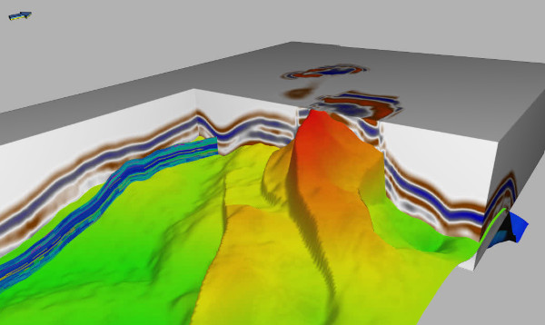

# Abstract

<p>This document describes Seismic Forward, a tool for generating
synthetic seismic from elastic parameters Vp, Vs and density.</p>

# Introduction

Seismic Forward is a tool for generating synthetic reflection seismic
data from elastic parameters Vp, Vs and density. The elastic parameters
are given in an Eclipse grid. The program is written in C++. The program
takes as input argument a model file of XML format, described in
[*Model file reference manual*](#model-file-reference-manual). The main
output is synthetic seismic data in SegY format and in a
STORM grid (which can easily be imported to RMS). The seismic can be
given in both time and depth, and seismic for various angles/offsets can
be generated. Various output parameters can be selected and written on
STORM or SegY format.

Release notes for recent versions are presented in
[*Release notes*](#release-notes). [*Theory*](#theory) gives a brief
description of the theory and the implementation, and
[*Model file reference manual*](#model-file-reference-manual) gives a
description of how to build a model file. [*File formats*](#file-formats)
gives description of file formats and references respectively.

# Release notes

## Version 4.5

## Version 4.4

## Version 4.3

*Reduce the number of grid cells with negative thicknesses when converting Eclipse grid to seismic grid.*

A considerable amount of time has been spent reducing the number of grid
cells with negative thicknesses. Given the flexibility enjoyed by
Eclipse grids, it has proven very difficult to remove these negative
thicknesses altogether. Important steps to improve the result:

A) Remove a division by zero bug that lead to “holes” in the generated
seismic data

B) Fill values in edge cells that were formerly empty and that gave edge
effects

C) Use the same Delaunay triangularization for all layers of the Eclipse
grid. This can be turned off with using keyword
[\<fixed-triangularization-of-eclipse-grid\>](#fixed-triangularization-of-eclipse-grid)


D) When extracting layers from Eclipse grid, require active columns
rather than active pillars

E) Use horizontal interpolation for the top and base surfaces of the
Eclipse grid - use vertical interpolation when mapping the grid. Prior to
version 4.3, horizontal interpolation was used for all layers. Vertical
interpolation can be turned off for the grid mapping using keyword
[\<vertical-interpolation-of-undefined-cells\>](#vertical-interpolation-of-undefined-cells)
and horizontal interpolation can be activated using keyword
[\<horizontal-interpolation-of-undefined-cells\>](#vertical-interpolation-of-undefined-cells).

If negative thicknesses are encountered, the file
negative_dz_points.rxat will be written to the output directory. The
file format is Roxar Attribute Text and the file contains the location
of negative thicknesses and attributes “Negative dz” and “Layer”. See
[*Resampling of depth*](#resampling-of-depth) for details.

*Wavelet export*

The wavelet can be exported using keyword [\<wavelet\>](#wavelet) which is
currently a part of element [\<output-parameters\>](#output-parameters).

*Wavelet from file*

When wavelet is read from file, the maximum amplitude (in absolute
value) is now picked automatically as zero-time reference. To use the
sample number for zero time specified in the wavelet file header, the
new keyword [\<zero-time-from-header\>](#zero-time-from-header) can be
used.

*Wavelet length*

The wavelet length is now estimated as the region where the amplitude
is at least 0.001 of the maximum amplitude. The cut-off factor used to
be 0.01 for wavelets read from file, but this gave noise in 4D data. For
consistency, a Ricker wavelet has its length calculated the same way.
For Ricker wavelets, the length was formerly defined to be 1000 / peak
frequency. The wavelet length can also be given as input using the
keyword [\<wavelet\>](#wavelet)[\<length\>](#length).

*White noise*

Prior to version 4.3, white noise was added to reflection coefficients.
Since this noise was convolved with the wavelet it was coloured. With
this release noise added using the [\<white-noise\>](#white-noise) keyword
adds noise to the synthetic seismic rather than to reflection coefficients.
Set [\<equal-noise-for-offsets\>](#equal-noise-for-offsets) to yes to have
the same noise added to all offsets. To have noise added to reflection
coefficients, the keyword [\<add-noise-to-refl-coef\>](#add-noise-to-refl-coef)
can be used.

*Grid padding*

Prior to version 4.3, the grid was always padded with half a wavelet
above the top and below the bottom. To get a different padding, the
keyword [\<padding-factor-seismic-modelling\>](#padding-factor-seismic-modelling)
can be used. The original padding, which is default, is obtained with the
factor 1.0.

*Log file*

When running Seismic Forward, an extensive log file is now generated.
This file reports the model setup and parameter settings as well as
statistics of both the elastic input parameters and output seismic data.
In addition, run-time choices that are made are reported. At the end of
the file some statistics for the generated seismic data are given.

*Test suite*

To avoid introducing errors and breaking functionality, a test suite
has been added to the Git repository. The test suite consists of a set
of different forward modelling jobs with predefined answers. When
running the test suite, output data are compared with the predefined
answers. If there are mismatches, these are reported. See the Github
README file for details on how to run the tests.

*Moved keywords/commands*

Keywords [\<max-threads\>](#max-threads) and
[\<traces-in-memory\>](#traces-in-memory) have been moved from top level
[\<seismic-forward\>](#seismic-forward) to new element
[\<project-settings\>](#project-settings).

# Theory

The output grid may cover the whole Eclipse grid, or a sub volume of the
Eclipse grid.

First, we resample the depth of each layer in the Eclipse grid using
Delaunay triangulation and store the values in a grid (see
[*Resampling of depth*](#resampling-of-depth)).
By default, centre point interpolation is used for the triangulation,
but corner point interpolation can also be used. Next, reflection
coefficients are calculated layer by layer (see
[*Calculation of reflection coefficients*](#calculation-of-reflection-coefficients)).
For this, elastic parameters must be resampled (see
[*Resampling of elastic parameters*](#resampling-of-elsatic-parameters)).
The elastic parameters are interpolated using Delaunay triangulation,
with centrepoints in top and bottom of cells, in a way similar to the depth
interpolation. The values are stored in a grid. In inactive cells where
no values for elastic parameters exist, we use default values provided
by the user. The user also must provide default values for use above and
below the reservoir. Cells with thickness smaller than 0.1\,m, or another
user defined limit, get the value from the cell above.

When the elastic parameters have been resampled, the two-way travel time
(measured in ms) is calculated for each layer k:

$$twt(k)\  = \ twt(k - 1)\  + \ 2000\lbrack z(k) - z(k - 1)\rbrack/vp(k)$$

Here z(k) is the depth in layer k. The values are stored in a grid.

Seismic data are calculated trace by trace using the convolution

$$seis(t)\ = \ \sum_{k = 0}^{n}{c(k)w\left\lbrack twt(k) - t \right\rbrack}$$

(1)

Here c(*k*) is the reflection at layer no *k*, and *w* is the
wavelet specified either as an input file or as a Ricker wavelet with a
user specified peak frequency (see [*Wavelet*](#wavelet)). *twt(k)* is the
two-way travel time at layer *k*.

White noise can be added to reflection coefficients or to the seismic
signal. To add noise to the reflection coefficients, use the keyword
[\<add-noise-to-refl-coef\>](#add-noise-to-refl-coef).
To add noise to the signal use keyword
[\<white-noise\>](#white-noise).
Noise added to the reflection coefficients will be
coloured by the wavelet.

## Calculation of reflection coefficients

We use an Aki Richards type linearization of the Zoeppritz equations,
given by Stolt and Weglein (1985). See also the Crava user
documentation, Dahle et al (2011).

For PP seismic, angle *θ* and time *t* we have

$$c(t,\theta) = {\ a}_{1}\frac{\mathrm{\Delta}Vp}{\overline{Vp}} + a_{2}\frac{\mathrm{\Delta}Vs}{\overline{Vs}} + a_{3}\frac{\mathrm{\Delta}\rho}{\overline{\rho}}\ \ \ \ \ \ \ \ (2)$$

Here $\mathrm{\Delta}Vp = Vp(t + ) - Vp(t - )$, where $t +$ and $t -$
are on each side of a cell border,
$\overline{Vp} = 0.5*\left( Vp(t + ) + Vp(t - ) \right)$, and similar
for *Vs* and *ρ*. The coefficients *a<sub>1</sub>*, *a<sub>2</sub>*, and
*a<sub>3</sub>* are given by

$$a_{1} = 0.5(1 + \tan^{2}\theta)$$

$$a_{2} = - 4\left( \frac{\overline{Vs}}{\overline{Vp}} \right)^{2}\sin^{2}\theta$$

$$a_{3} = 0.5(1 - a_{2})$$

Here *θ* is the offset angle.

For PS seismic, we have

$$a_{1} = 0$$

$$a_{2} = 2\frac{\sin\theta}{\cos\varphi}\left( \left( \frac{\overline{Vs}}{\overline{Vp}} \right)^{2}\sin^{2}\theta - \frac{\overline{Vs}}{\overline{Vp}}\cos{\theta\cos\varphi} \right)$$

$$a_{3} = \frac{\sin\theta}{cos\varphi}\left( - 0.5 + \left( \frac{\overline{Vs}}{\overline{Vp}} \right)^{2}\sin^{2}\theta - \frac{\overline{Vs}}{\overline{Vp}}\cos{\theta\cos\varphi} \right)$$

Here, $\varphi$ is the PS reflection angle, given by
$\sin\varphi = Vs/Vp \bullet \sin\theta$.

## Resampling of depth

Each layer in the Eclipse grid is resampled to a regular grid. The
lateral grid resolution is the same as for the seismic data.

The default is to use centre point interpolation. The routine loops all
eclipse cells, and for each cell (i, j), we collect centre point in top
or bottom of cell (i, j) and the neighbour points (i + 1, j), (i + 1,
j + 1) and (i, j + 1). The area defined by these four points is divided
into two triangles by Delaunay decomposition in the xy-plane as shown in
Figure 1.

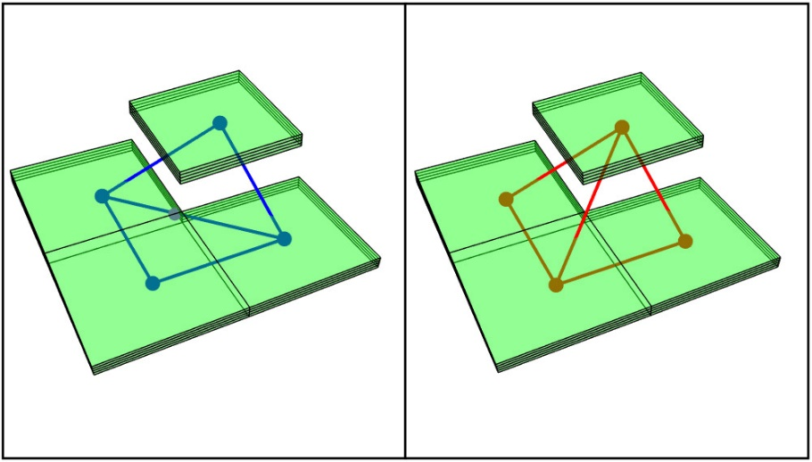
Figure 1: Illustration of Delaunay triangulation.

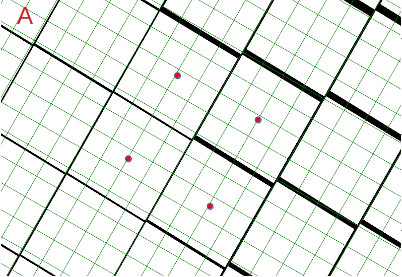 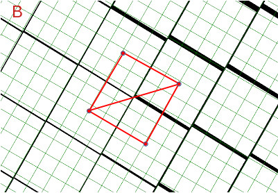
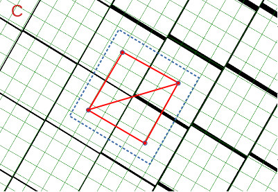 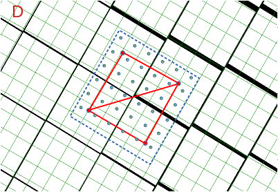

Figure 2: Resampling of depth. The resampled grid is shown as green, and
the original Eclipse grid as black.

Each triangle defines a local surface, and all points inside a triangle
get their z value from this surface. The decomposition can be made in
two different ways. Prior to version 4.3, the decomposition was made
such that the corner not common to the two triangles had a largest
possible angle. To avoid negative thicknesses in the grid, it turns out
that the decomposition must be the same for all layers of the Eclipse
grid. By definition, the “blue” approach is therefore always taken.

Figure 2 A – D illustrates how the depth values of the Eclipse grid are
mapped into a regular grid. The slightly faulted Eclipse grid is shown
as a black mesh, while the regular grid to which it shall be mapped is
shown as a green mesh. In A, the centre points of four adjacent Eclipse
grid cells are high-lighted as red bullets. In B, the Delaunay
decomposition/triangularization has been applied to these four centre
points. A rectangle is created in the regular grid that covers these
centre points as well as a neighbourhood around them. The neighbourhood
is added to avoid edge effects. This rectangle is shown in C as a blue
dashed line. All grid cells in the regular grid that have their centre
points inside this rectangle are assigned a value from the Delaunay
triangle it belongs to. This is shown in D.

Since grid cells outside the red rectangles are assigned depth values,
most grid cells are assigned values from more than one quartet of
Eclipse grid cells. This is corrected for at the end of the resampling
by taking the average of the depth values that have been assigned to a
given cell.

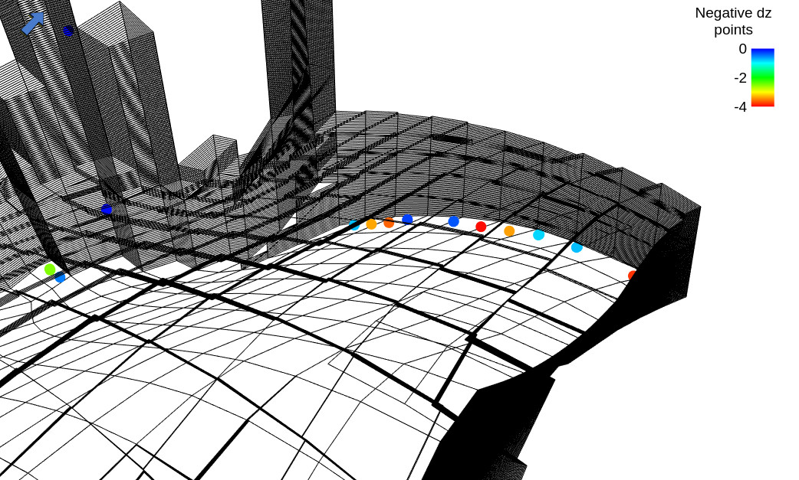

Figure 3: Visualization of places with negative thicknesses.

Alternatively, we can use corner point interpolation, and collect
corners of each Eclipse cell. The area within these points is divided
into two triangles, as described above. The corner point algorithm is
not suitable if the grid contains reverse faults, which means that cells
in different layers overlap each other. If the grid contains large cells
which are not overlapping, corner point interpolation could be the best
choice. At some point, a post-processing of layers at fault locations
were implemented. This processing does not seem to improve the result
and its geometrical intention is undocumented. It has therefore been
turned off by default but can be activated with the keyword
[\<cornerpt-interpolation-at-faults\>](#cornerpt-interpolation-at-faults).

After the resampling, some grid cells in the regular grid may remain
empty. These are filled using vertical interpolation between the closest
defined grid cell above and below. If all grid cells above or below are
empty, the top and base surface of the Eclipse grid are used for
interpolation. These surfaces are generated in the same way as the grid
resampling and may themselves contain empty cells. Such empty cells are
filled using horizontal interpolation. Starting with the “centre of
mass” of the grid nodes in the resampled surface that have a value,
empty grid nodes at increasing distance from this centre are filled.
Each node is assigned the average of its neighbours. This procedure is
iterated until all grid nodes have a value defined. All vertical
interpolation can be omitted using the
[\<vertical-interpolation-of-undefined-cells\>](#vertical-interpolation-of-undefined-cells)
keyword. By default, vertical interpolation is used.

For grids with complex faulting, some grid cells may end up with
negative thicknesses. Such cells can have their thicknesses set to zero
using the [\<remove-negative-delta-z\>](#remove-negative-delta-z) keyword.
Negative thicknesses are written to the file negative_dz_points.rxat as
points with attributes “Negative dz” and “Layer”. The file format is
*Roxar Attribute Text*. These points can be used to visualize where the
negative thicknesses are located as illustrated in Figure 3.

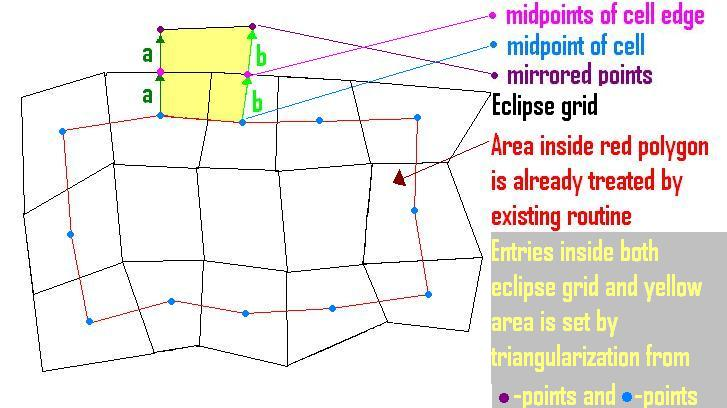

Figure 4: Treatment of edges when resampling elastic parameters.

## Resampling of elastic parameters

This is done in a similar way as for the depth. To calculate
reflections, values at both top and base of cells must be resampled. If
a cell is inactive, default values for the parameters are used in
triangularization. For inactive cells with thickness less than a given
limit (default is 0.1 m), the value in the cell above is used.

Since we use centre of cells, an edge around the eclipse grid is not
treated by this algorithm, see Figure 4. In this region, we use
mirroring values to the outside of the eclipse grid, and then filling
out unwritten values on the inside by triangulation. If a cell is
inactive, default values for the parameters are used in the
triangularization.

## Wavelet

The wavelet can be read from file or specified parametrically as a
Ricker wavelet. The ricker wavelet is given by the expression

$$w(t,a) = (1 - {2at}^{2})exp( - {at}^{2})$$

where a = (πν)<sup>2</sup> and ν is the peak frequency that must be
specified by the user. The Ricker wavelet with a peak frequency of 25 Hz
is shown in Figure 5.

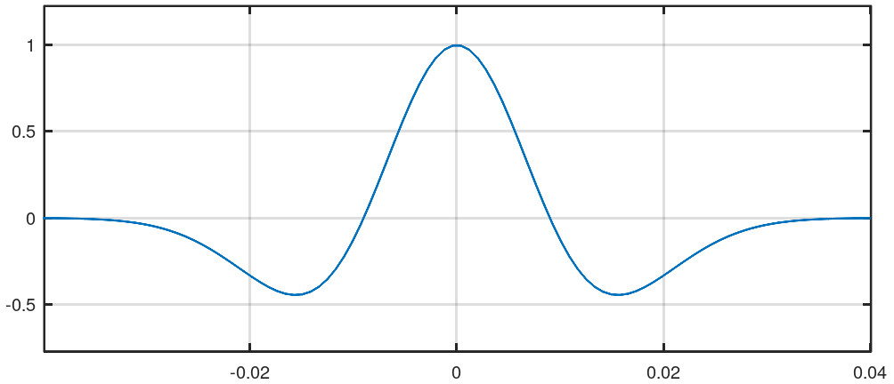

Figure 5: The Ricker wavelet with a peak frequency of 25 Hz.

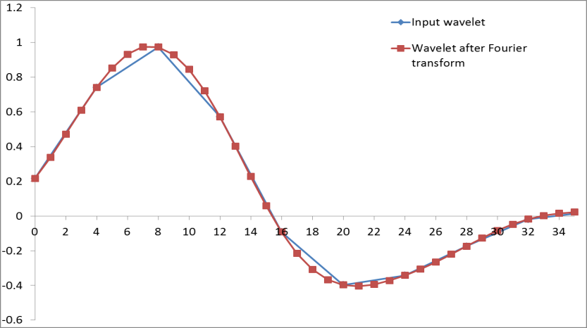

Figure 6: Smoothening of the wavelet.

If the wavelet is read from file, the file format must be Landmark ASCII
Wavelet (see
[*Landmark ASCII Wavelet input file*](#landmark-ascii-wavelet-input-file)).
Before calculating seismic data, the wavelet
is smoothed. This is done by transforming the wavelet to the Fourier
domain where the sampling density is increased. After the back-transform
to time domain the sampling density has increased to approximately 1 ms.
Because of this smoothening, synthetic seismic data will depend on the
sampling density of the wavelet. The smoothening is depicted in Figure
6.

The maximum amplitude of the wavelet is identified automatically, and
for wavelets read from file, the maximum location specified in the
header is over-run. The wavelet length is set to be the part of the
wavelet where the amplitude is at least 0.001 of the maximum amplitude.

## NMO stretch

Normal moveout (NMO) is the effect the offset has on the arrival time of
the reflection. The offset is the distance between a seismic source and
a receiver; see Figure 7. Increasing offset gives an increasing delay in
the arrival time of a reflection from a horizontal surface. A plot of
arrival times versus offset has a hyperbolic shape. To adjust each event
to its associated zero-offset arrival time, the seismic must be NMO
corrected. NMO correction is basically a shift of the seismic in time.
An effect of NMO is a stretching of the wavelet with increasing offset,
referred to as NMO stretch. The NMO stretch is highest at far offsets
and at early times, where the NMO correction is the most pronounced.

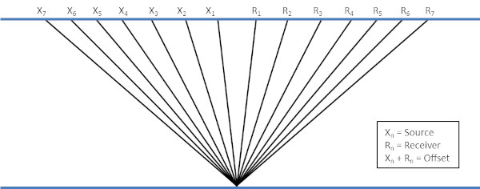

Figure 7: Path from source to receiver for seismic traces with various
offsets.

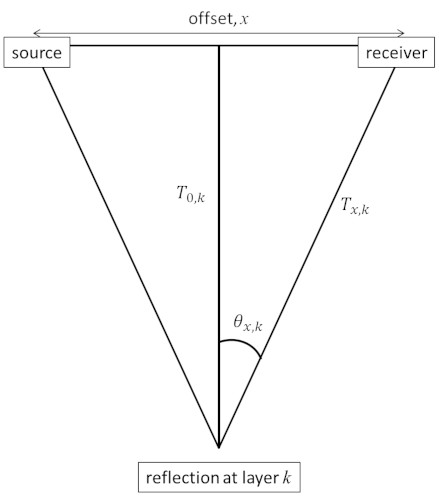

Figure 8: Geometry of a seismic reflection at layer *k*.

### Generation of seismic data with NMO stretch

When generating seismic data with NMO stretch, the first step is to make
root-mean-square velocities (RMS velocity) for all reflectors/layers
including the sea floor. Interval velocity in the overburden must be
estimated to get the RMS velocities in the reservoir. This is calculated
from time and depth values for top reservoir plus user specified values
for seabed (See
[\<seafloor-depth\>](#seafloor-depth-necessary) and
[\<velocity-water\>](#velocity-water-necessary)).
The RMS velocity at layer *k* is given as:

$v_{rms,k} = \sqrt{\frac{\sum_{i = 0}^{k}{v_{i}^{2}{\mathrm{\Delta}t}_{i}}}{T_{0,k}}\ \ \ }$<sub>,</sub>

where $v_{i}$ and $\mathrm{\Delta}t_{i}$ are the interval velocity and
the interval two-way time (TWT) of layer *i* and $T_{0,k}$ is the TWT at
zero offset down to layer *k*.

When the average velocities have been calculated, the TWTs down to each
layer are calculated for every offset, see Figure 8. TWT to layer *k*
for offset *x* is given as:

$T_{x,k} = \sqrt{T_{0,k}^{2} + \frac{x^{2}}{v_{rms,k}^{2}}\ }$. (3)

The offset angle for each offset *x* and layer *k* is calculated as

$\theta_{x,k} = \tan^{- 1}\left( \frac{x}{v_{rms,k} \bullet T_{0,k}} \right)$.

The corresponding reflection coefficient at layer *k* for given offset
*x*, $c(\theta_{x,k})$, is calculated according to Equation 2. The
seismic trace at time *t* is calculated as:

$seis(t) = \ \sum_{k = 0}^{n}{c\left( \theta_{x,k} \right)Wavelet\left\lbrack T_{x,k} - t \right\rbrack}$.
(4)

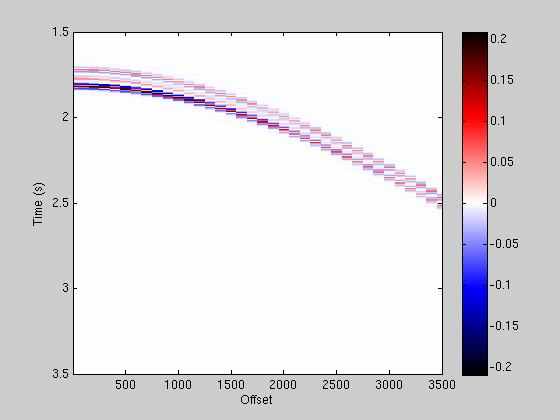

Figure 9: Example of seismic gather for offsets from 0 to 3500m.

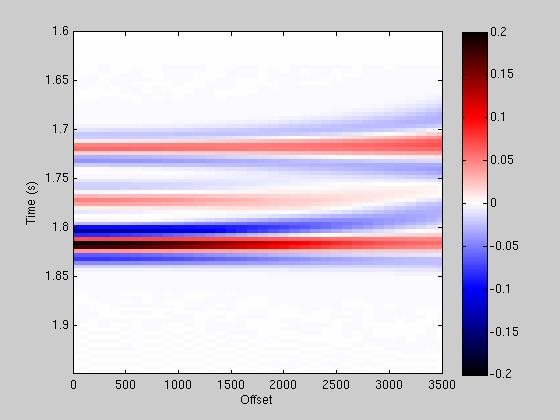

Figure 10: Example of seismic gather after NMO correction for offsets
from 0 to 3500m.

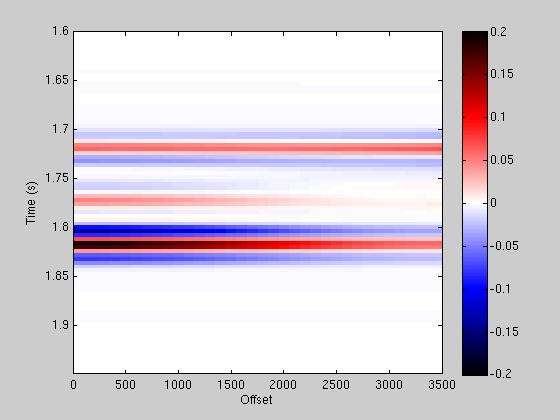

Figure 11: Example of seismic gather generated without NMO-stretch for
offsets from 0 to 3500m.

### NMO correction

The seismic data in Equation 4 are sampled regularly in time,
$t = \ \left\lbrack t_{0},t_{0} + \mathrm{\Delta}t,\ t_{0} + 2\mathrm{\Delta}t,\ldots \right\rbrack$.
For each time sample, *t*, the corresponding *t<sub>x</sub>* is
calculated according to Equation 3. To calculate *t<sub>x</sub>* the RMS
velocity is resampled according to *t* using linear interpolation. The
generated seismic data are resampled into *t<sub>x</sub>* with a cubic
spline interpolation. These data are NMO corrected. See Figure 9 and
Figure 10 for examples of seismic data before and after NMO correction.
The NMO stretch is visible at far offsets in Figure 10. As a comparison,
Figure 11 shows the same example of a seismic gather generated without
NMO stretch.

### Offset seismic without NMO stretch

Seismic data for various offsets can be generated without considering
the increasing delay in the arrival time with offset, that is, without
NMO-stretch. This is done by the same procedure as seismic with NMO
stretch by letting offset *x =* 0 in Equation 3,
giving$\ T_{x,k} = T_{0,k}$. Such seismic data are generated according
to the zero-offset TWT, but with reflection angles corresponding to the
geometry in Figure 8.

## Depth conversion and time shifts

The seismic data are generated regularly in time
$t = \ \left\lbrack t_{0},t_{0} + \mathrm{\Delta}t,\ t_{0} + 2\mathrm{\Delta}t,\ldots \right\rbrack$
and resampled into *t<sub>x</sub>* in case of seismic with NMO-stretch.
Depth converted and time-shifted seismic is established from the
generated seismic in time by interpolating the amplitudes into new grids
in depth or time, respectively.

*Depth conversion:
*The depths *z<sub>t</sub>* corresponding to
$t = \ \left\lbrack t_{0},t_{0} + \mathrm{\Delta}t,\ t_{0} + 2\mathrm{\Delta}t,\ldots \right\rbrack$
are found through linear interpolation of the depth-to-TWT relationship
established in the re-gridding of the model. This way the seismic data
generated at *t* can also be associated with *z<sub>t</sub>*.

To get seismic data regularly sampled in depth, data are interpolated
into
$z = \ \left\lbrack z_{0},z_{0} + \mathrm{\Delta}z,\ z_{0} + 2\mathrm{\Delta}z,\ldots \right\rbrack$.
This is done using cubic spline interpolation, provided the seismic is
“sampled” according to *z<sub>t</sub>*.

*Seismic time shift:
*The seismic is shifted in time basically using the same procedure as
the depth conversion. The shifted times *t<sub>s</sub>* corresponding to
*t* are found through linear interpolation based on the relationship
between TWT and shifted TWT at each layer of the reservoir. The seismic
is regularly sampled into the shifted times using cubic spline
interpolation, provided the seismic is “sampled” according to
*t<sub>s</sub>*.

#  Model file reference manual

This section describes how to build a model file for the Seismic Forward
program. The model file uses the XML file structure. XML files are built
with start and end tags, encapsulating other tags or values. All model
files start with \<seismic-forward\> and end with \</seismic-forward\>.

In addition to the normal \<!-- --\> tags used to place comments in the
file, the character ‘#’ can also be used. All text following this
character on the same line is considered a comment. Please note, that if
this character is used XML file readers may treat the file as corrupt.

All commands are optional, unless otherwise stated. A necessary command
under an optional is only necessary if the optional is given.

The following units are assumed throughout the XML model file:

```
o-------------------------------------------------------o
| Type             | Unit                               |
|------------------|------------------------------------|
| Depth and length | Meter - m                          |
| Time             | Millisecond - ms                   |
| Velocity         | Meter per second - m/s             |
| Density          | Kilogram per cubic metres - kg/m^3 |
| Angles           | Degrees                            |
o-------------------------------------------------------o
```

## \<elastic-param\> (necessary)

*Description*: Contains Eclipse grid file name, default values and name
of elastic parameters in file. Interpolation method for depth values can
optionally be chosen here, and a limit for treating cells as zero
thickness cells can be set.

Example:

```
<elastic-param>
  <eclipse-file> test_2006.grdecl </eclipse-file>
  <default-values>
    <vp-top>           3800  </vp-top>
    <vp-mid>           3400  </vp-mid>
    <vp-bot>           3800  </vp-bot>
    <vs-top>           1200  </vs-top>
    <vs-mid>           1900  </vs-mid>
    <vs-bot>           2100  </vs-bot>
    <rho-top>          2400  </rho-top>
    <rho-mid>          2400  </rho-mid>
    <rho-bot>          2400  </rho-bot>
  </default-values>
  <parameter-names>
    <vp>      VP_2006-07-01  </vp>
    <vs>      VS_2006-07-01  </vs>
    <rho>   DENS_2006-07-01  </rho>
  </parameter-names>
</elastic-param>
```

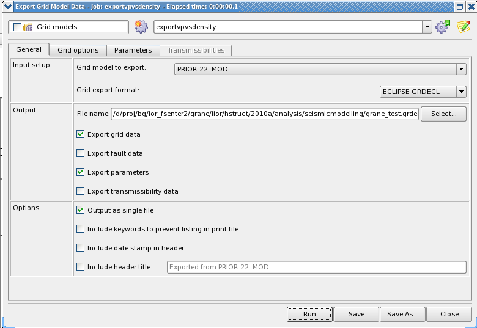
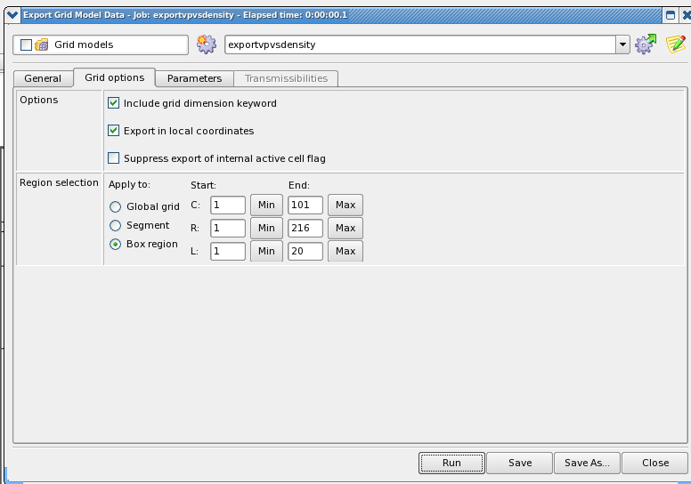
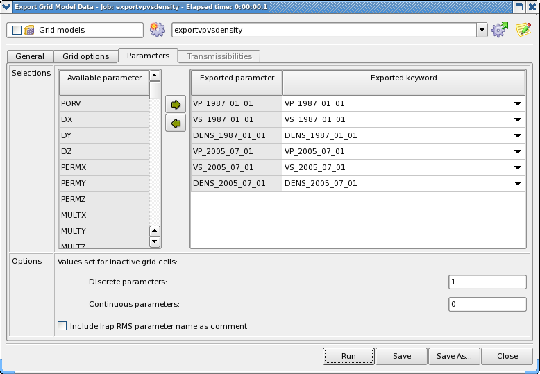

Figure 12: Export of Eclipse grids (grdecl file) from RMS.

### \<eclipse-file\> (necessary)

*Description:* Name of Eclipse grid file containing elastic parameters.
Figure 12 shows how to export an Eclipse grid from RMS.

Argument: File name.

### \<default-values\> (necessary)

*Description*: Values of Vp, Vs, and rho over and under reservoir, and
in missing cells within reservoir.

#### \<vp-top\> (necessary)

*Description*: Default value of vp above reservoir.

Argument: double

#### \<vp-mid\> (necessary)

*Description:* Default value of vp within reservoir. To be used at
places with missing data.

Argument: double

#### \<vp-bot\> (necessary)

*Description:* Default value of vp below reservoir.

Argument: double

#### \<vs-top\> (necessary)

*Description:* Default value of vs above reservoir.

Argument: double

#### \<vs-mid\> (necessary)

*Description:* Default value of vs within reservoir. To be used at
places with missing data.

Argument: double

#### \<vs-bot\> (necessary)

*Description:* Default value of vs below reservoir.

Argument: double

#### \<rho-top\> (necessary)

*Description:* Default value of density above reservoir.

Argument: double

#### \<rho-mid\> (necessary)

*Description:* Default value of density within reservoir. To be used at
places with missing data.

Argument: double

#### \<rho-bot\> (necessary)

*Description:* Default value of density below reservoir.

Argument: double

### \<parameter-names\> (necessary)

*Description:* Name of elastic parameters in Eclipse file

#### \<vp\> (necessary)

*Description:* Name of vp parameter in Eclipse file

Argument: String

#### \<vs\> (necessary)

*Description:* Name of vs parameter in Eclipse file

Argument: String

#### \<rho\> (necessary)

*Description:* Name of density parameter in Eclipse file

Argument: String

### \<extra-parameters\>

*Description:* Name and default value of extra parameter. This command
must be repeated for each extra parameter.

To write the extra parameters to time or depth segy files the commands
[\<extra-parameters-time-segy\>](#extra-parameters-time-segy) and/or
[\<extra-parameters-depth-segy\>](#extra-parameters-time-segy) under
[\<output-parameters\>](#output-parameters) must be given.

#### \<name\> (necessary)

*Description:* Name of extra parameter in Eclipse file

Argument: String

#### \<default-value\> (necessary)

*Description:* Default value of extra parameter

Argument: double

### \<cornerpt-interpolation-in-depth\>

*Description:* Using corner-point interpolation instead of centre point
interpolation when interpolating the depth of each layer in the Eclipse
grid.

*Argument:* Yes or no, default is no.

### \<cornerpt-interpolation-at-faults\>

*Description:* For corner-point interpolation, a post processing around
faults can be activated using this keyword. This post-processing is not
documented and currently not recommended.

*Argument:* Yes or no, default is no.

### \<zero-thickness-limit\>

*Description:* If cell thickness is less than this limit, it should be
treated as a zero-thickness cell, and get its value from the cell above.
The value is in meters.

*Argument:* double, default is 0.1.

### \<remove-negative-delta-z\>

*Description:* If cell thickness is negative, thickness is set to zero
by using this keyword.

*Argument:* Yes or no, default is no.

### \<vertical-interpolation-of-undefined-cells\>

*Description:* If cell thickness is undefined, it can be interpolated
from the nearest defined cells above and below.

*Argument:* Yes or no, default is yes.

### \<horizontal-interpolation-of-undefined-cells\>

*Description:* If cell thickness is undefined, it can be interpolated
from the nearest defined cells in the same layer.

*Argument:* Yes or no, default is no.

### \<fixed-triangularization-of-eclipse-grid\>

*Description:* Cells in the regular grid are interpolated from the
Eclipse grid using Delaunay triangularization. This triangularization
normally depends on the grid cell shape. However, unless the
triangularization is chosen equal (fixed) for all cells having the same
lateral position, negative thicknesses may be encountered. Using equal
triangularization, on the other hand, may lead to rougher edges in
faults etc.

*Argument:* Yes or no, default is yes.

### \<resampl-param-to-segy-with-interpol\>

*Description:* Vertically resample elastic or extra parameters into
depth or time samples of SegY grid using interpolation rather than index
mapping.

*Argument:* Yes or no, default is no.

## \<angle\>

*Description:* Offset angle for seismic. Seismic cubes with offset angle
***theta-0***, ***theta-0 + dtheta***, ***theta-0 +*** 2***\*dtheta …
theta-max***, will be generated. The command is optional, and if not
given, only zero offset seismic is generated.

Example:

```
<angle>
  <theta-0>     0  </theta-0>
  <dtheta>      5  </dtheta>
  <theta-max>  30  </theta-max>
</angle>
```

### \<theta-0\>

*Description:* Smallest offset angle.

*Argument:* double, default is 0.0.

### \<dtheta\>

*Description:* Increment for offset angle.

*Argument:* double, default is 0.0.

### \<theta-max\>

*Description:* Largest offset angle.

*Argument:* double, default is 0.0.

## \<wavelet\> (necessary)

*Description:* Specifies which wavelet to use. One of the two commands
[\<ricker\>](#ricker) or [\<from-file\>](#from-file) must be specified.

### \<ricker\>

*Description*: The Ricker wavelet.

Example:

```
<wavelet>
  <ricker>
    <peak-frequency> 20 </peak-frequency>
  </ricker>
</wavelet>
```

#### \<peak-frequency\> (necessary)

*Description:* Peak frequency for Ricker wavelet

Argument: double

### \<from-file\>

*Description*: Wavelet is specified in an input file.

Example:

```
<wavelet>
  <from-file>
    <format>                Landmark              </format>
    <file-name>             wavelet_landmark.txt  </file-name>
    <zero-time-from-header> yes                   </zero-time-from-header>
  </from-file>
</wavelet>
```

#### \<format\> (necessary)

*Description:* Format of wavelet file. So far, only
[Landmark ASCII Wavelet input file](#landmark-ascii-wavelet-input-file))
is implemented.

*Argument:* Landmark

#### \<file-name\> (necessary)

*Description:* Filename of wavelet file. The Landmark ASCII Wavelet
format is supported as wavelet input file.

#### \<zero-time-from-header\>

*Description:* Choose whether zero time is to be taken from the file
header or to be calculated as the sample position of the wavelet maximum
amplitude.

Argument: Yes or no, default is no.

### \<scale\>

*Description:* Scaling factor for wavelet. An increase in impedance
gives a positive peak.

*Argument:* double, default is 1.0.

### \<length\>

*Description:* Specifies the wavelet length in ms.

*Argument:* double, default is undefined and the length is estimated.

## \<white-noise\>

*Description:* This adds white noise to the generated seismic data. The
white noise is sampled from a normal distribution with zero mean and a
standard deviation as specified.

Example:

```
<white-noise>
  <equal-noise-for-offsets>   yes  </equal-noise-for-offsets>
  <standard-deviation>       0.02  </standard-deviation>
  <seed>                   123456  </seed>
</white-noise>
```

### \<standard-deviation\>

*Description:* Standard deviation to the white noise.

*Argument:* double, default is 1.0.

### \<seed\>

*Description:* Seed number. If this command is not given, a random seed
number will be used.

*Argument:* integer

### \<equal-noise-for-offsets\>

*Description:* This lets you choose between unique noise for each offset
or equal noise for all offsets.

*Argument:* Yes or no, default is no.

## \<add-noise-to-refl-coef\>

*Description:* This adds white noise to *the reflection coefficients*.
The white noise is sampled from a normal distribution with zero mean and
a standard deviation as specified. This results in coloured noise in the
seismic data, and the noise model is consistent with the model in Buland
and Omre (2003).

Example:

```
<add-noise-to-refl-coef>
  <standard-deviation>   0.02  </standard-deviation>
  <seed>               123456  </seed>
</add-noise-to-refl-coef>
```

### \<standard-deviation\>

*Description:* Standard deviation to the white noise.

*Argument:* double, default is 1.0.

### \<seed\>

*Description:* Seed number. If this command is not given, a random seed
number will be used.

*Argument:* integer

## \<nmo-stretch\>

*Description:* When this command is specified, a seismic gather
according to the specified offsets is generated for each position. The
arrival time for each offset is modelled with hyperbolic NMO. The
seismic is thereafter NMO-corrected to the associated zero-offset time,
giving NMO-stretch in the modelled data. To perform NMO-correction, the
seafloor depth and velocity in water is required. This command has
priority over [\<angle\>](#angle), which means that if both
[\<nmo-stretch\>](#nmo-stretch) and [\<angle\>](#angle) are specified,
[\<angle\>](#angle) is ignored.

Example:

```
<nmo-stretch>
  <seafloor-depth>   200  </seafloor-depth>
  <velocity-water>  1500  </velocity-water>
  <offset>
    <offset-0>         0  </offset-0>
    <doffset>         50  </doffset>
    <offset-max>    2000  </offset-max>
  </offset>
</nmo-stretch>
```

### \<seafloor-depth\> (necessary)

*Description:* Depth of seafloor.

*Argument:* double

### \<velocity-water\> (necessary)

*Description:* Velocity in water.

*Argument:* double

### \<offset\>

*Description:* Offset for seismic. Seismic traces will be generated for
offset ***offset-0***, ***offset-0 + doffset***, ***offset-0 +***
2***\*doffset … offset-max***. The command is optional, and if not
given, only zero offset seismic is generated.

#### \<offset-0\>

*Description:* Smallest offset.

*Argument:* double, default is 0.0.

#### \<doffset\>

*Description:* Increment for offset.

*Argument:* double, default is 0.0.

#### \<offset-max\>

*Description:* Largest offset.

*Argument:* double, default is 0.0.

### \<offset-without-stretch\>

*Description:* If this command is specified, seismic data are generated
according to offset and without NMO stretch. This means that the arrival
time for each offset is assumed identical to zero-offset, and no NMO
correction is applied. This option will give seismic similar, but not
identical to the [\<angle\>](#angle) option since seismic is generated for
constant offset gathers rather than constant angle gathers.

*Argument:* Yes or no, default is no.

## \<output-grid\> (necessary)

*Description:* Specifies the dimensions of the resulting seismic grid
and a possible window for output files.

The area used in the forward modelling can be defined in four different
ways. If the default approach is not taken, the options have a
prioritized order in case several are specified.

1)  By default, the area is defined by the Eclipse grid, automatically
    calculated as the smallest rectangle covering the active cells in
    the Eclipse grid.

2)  [\<area-from-segy\>](#area-from-segy), where area is specified by a SegY file.

3)  [\<area\>](#area), where a rectangle area can be specified.

4)  [\<area-from-surface\>](#area-from-surface), where area is specified by a Roxar text file.

The modelling interval is from top reservoir to bottom reservoir. In
addition, there is a padding above and below the grid. By default, this
padding is half a wavelet on both sides, but this can be adjusted with the
[\<padding-factor-seismic-modelling\>](#padding-factor-seismic-modelling)
keyword. The time value corresponding to the top reservoir can be specified
under [\<top-time\>](#top-time), and the cell size of the seismic grid can
be specified under [\<cell-size\>](#cell-size). For SegY output format,
the segy indexes can be specified under [\<segy-indexes\>](#segy-indexes)
and UTM precision under [\<utm-precision\>](#utm-precision). Output
window in time or depth can be specified under [\<time-window\>](#time-window)
and [\<depth-window\>](#depth-window).

Example:

```
<output-grid>
  <top-time>
    <top-time-constant> 1200 </top-time-constant>
  </top-time>
  <cell-size>
    <dx> 50 </dx>
    <dy> 50 </dy>
    <dz> 1 </dz>
    <dt> 4 </dt>
  </cell-size>
  <area-from-surface> top.irap </area-from-surface>
  <time-window>
    <top> 1000 </top>
    <bot> 2000 </bot>
  </time-window>
  <padding-factor-seismic-modelling> 1.0
  </padding-factor-seismic-modelling>
</output-grid>
```

### \<area-from-surface\>

*Description:* A surface on Roxar text format is used to specify area.
This command is not active if [\<area\>](#area) or [\<area-from-segy\>](#area-from-segy)
is given.

*Argument:* String with name of Roxar text surface file.

### \<area-from-segy\>

*Description:* A segy file is used to specify area. Some standard SegY
trace header formats are recognized, see
[*SegY header format for output*](#segy-header-format-for-output).
Other formats can be specified by the user, by using the key words
[\<il0\>](#il0), [\<xl0\>](#xl0), [\<utmxLoc\>](#utmxLoc), and
[\<utmyLoc\>](#utmyLoc).

### \<padding-factor-seismic-modelling\>

*Description:* The number of half-wavelets that are added above and
below the grid as padding before the forward modelling. Useful when
adding white noise, especially for larger offsets.

*Argument:* double. Default value is 1.0

#### \<filename\> (necessary)

*Description:* Name of segy file.

*Argument:* String with name of segy file.

#### \<il0\>

*Description:* Byte number for inline start in trace header in the given
file.

*Argument:* integer

#### \<xl0\>

*Description:* Byte number for crossline start in trace header in the
given file.

*Argument:* integer

#### \<utmxLoc\>

*Description:* Byte number for location of x coordinate in trace header
in the given file.

*Argument:* integer

#### \<utmyLoc\>

*Description:* Byte number for location of y coordinate in trace header
in the given file.

*Argument:* integer

### \<area\>

*Description:* Defines the area of the seismic cube. See Figure 13 for
an illustration of the parameters required. If specified, all parameters
must be given. This command is not active if
[\<area-from-segy\>](#area-from-segy) is given.

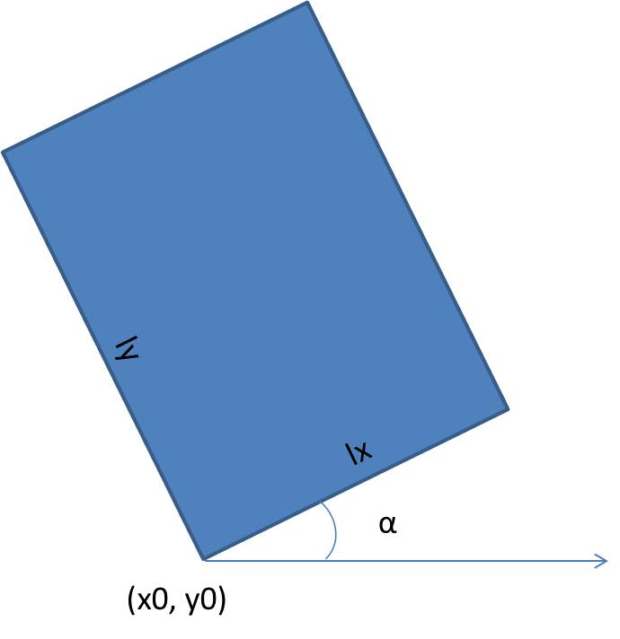

Figure 13: Illustration of area parameters.

#### \<x0\> (necessary)

*Description:* x coordinate of lower left corner point, see Figure 13.

*Argument:* double

#### \<y0\> (necessary)

*Description:* y coordinate of lower left corner point, see Figure 13.

*Argument:* double

#### \<lx\> (necessary)

*Description:* Length of area in local x direction, se Figure 13.

*Argument:* double

#### \<ly\> (necessary)

*Description:* Length of area in local y direction, see Figure 13.

*Argument:* double

#### \<angle\> (necessary)

*Description:* Rotation angle of area, see Figure 13.

*Argument:* double

### \<top-time\>

*Description:* Specifies time value corresponding to top of reservoir.
When modelling seismic with the [\<nmo-stretch\>](#nmo-stretch) option,
the top time value is used in calculation of rms-velocity down to top
reservoir, and hence should be given a realistic value. This is also
important when modelling seismic in depth.

#### \<top-time-surface\>

*Description:* Specifies a surface in time corresponding to top
reservoir. The surface must be of type Roxar text. If the surface
contains missing areas, the seismic will be missing (set to zero) in
these areas.

*Argument:* String with name of Roxar text surface file.

#### \<top-time-constant\>

*Description:* Specifies a constant time value corresponding to top
reservoir. The constant time corresponds to the top point of the Eclipse
grid.

*Argument:* double, default value is 1000.0.

### \<cell-size\>

*Description:* The cell size in the seismic grid is given here.

#### \<dx\>

*Description:* Cell size in x direction. If [\<area-from-segy\>](#area-from-segy)
is given, dx is taken from segy file.

*Argument:* double, default value is 25m.

#### \<dy\>

*Description:* Cell size in y direction. If [\<area-from-segy\>](#area-from-segy)
is given, dy is taken from segy file.

*Argument:* double, default value is 25m.

#### \<dz\>

*Description:* Cell size in vertical direction, for seismic in depth
domain.

*Argument:* Double, default value is 4m.

#### \<dt\>

*Description:* Cell size in vertical direction, for seismic in time
domain.

*Argument:* Double, size given in ms. Default value is 4ms.

### \<segy-indexes\>

*Description:* Specifies the inline and crossline start point and the
axis of the inline direction for grid output on SegY format. The command
should not be used if [\<area-from-segy\>](#area-from-segy) is used, then
the geometry is taken from the input segy file.

The inline and crossline directions are determined based on the geometry
parameters specified under [\<area\>](#area) and [\<cell-size\>](#cell-size).
By specifying [\<inline-direction\>](#inline-direction) to “x” the inline
and crossline directions are basically swopped.

Example:

```
<segy-indexes>
  <inline-start> 5 </inline-start>
  <xline-start> 5 </xline-start>
  <inline-direction> y </inline-direction>
</segy-indexes>
```

#### \<inline-start\>

*Description:* Location of inline start.

*Argument:* integer, default is 0.

#### \<xline-start\>

*Description:* Location of crossline start.

*Argument:* integer, default is 0.

#### \<inline-direction\>

*Description:* Axis of the inline direction. Legal arguments are x and
y.

*Argument:* String, default is y.

#### \<inline-step\>

*Description:* Step size and direction for stepping along inline, where
positive numbers mean positive inline direction and negative numbers
mean negative inline direction.

*Argument:* Positive or negative integers, default is 1.

#### \<xline-step\>

*Description:* Step size and direction for stepping along crossline,
where positive numbers mean positive inline direction and negative
numbers mean negative inline direction.

*Argument:* Positive or negative integers, default is 1.

### \<utm-precision\>

*Description:* Specifies the numerical precision of the UTM-coordinates
in the header of the output segy file. *The precision is limited by the
size of an integer (2<sup>31</sup> - 1). If the precision exceeds this
limit, i.e. if the number of significant digits exceeds ~10, a message
will be given and no SegY file will be written.*

*Argument:* possible arguments are 0.0001, 0.001, 0.01, 0.1, 1, 10, 100,
1000 and 10000, default is 0.1.

### \<time-window\>

*Description:* Specifies a time window for all output files in time.

#### \<top\>

*Description:* Specifies the top of the time window.

*Argument:* double

#### \<bot\>

*Description:* Specifies the bottom of the time window.

*Argument:* double

### \<depth-window\>

*Description:* Specifies a depth window for all output files in depth.

#### \<top\>

*Description:* Specifies the top of the depth window.

*Argument:* double

#### \<bot\>

*Description:* Specifies the bottom of the depth window.

*Argument:* double

## \<output-parameters\>

*Description:* Keyword to specify output variables from the program.

Example:

```
<output-parameters>
  <prefix> parameters </prefix>
  <elastic-parameters> yes </elastic-parameters>
  <reflections> yes </reflections>
</output-parameters>
```

### \<prefix\>

*Description:* Name prefix of all output files.

*Argument:* String, default is empty string.

### \<suffix\>

*Description:* Name suffix of all output files.

*Argument:* String, default is empty string.

### \<elastic-parameters\>

*Description:* Writes resampled vp, vs, rho in Storm format to files
“*prefix*+\_vp\_+*suffix* +.storm”, “*prefix*+\_vs\_+*suffix*+.storm”
and “*prefix*+\_rho\_+*suffix*+.storm”. Depth is not correct; the output
grid is a regular grid with the resampled values in each layer of the
Eclipse grid.

*Argument:* Yes or no, default is no.

### \<reflections\>

*Description:* Writes a cube with reflection coefficients at each layer
of the Eclipse grid at the minimum specified angle or offset. The
reflections are written in Storm format to file
“*prefix*+\_reflections\_*theta*\_ +*suffix*+.storm” or
“*prefix*+\_reflections\_*offset*\_ +*suffix*+.storm”, where *theta* is
the angle given under \<theta-0\> (Section 4.2.1) and *offset* is the
offset given under \<offset-0\> (Section 4.6.3.1). If white noise is
added to the reflections (Section 4.4), reflections with white noise are
written to file
“*prefix*+\_reflections_noise\_*theta*\_+*suffix*+.storm” or
“*prefix*+\_reflections_noise\_*offset*\_+*suffix*+.storm”.

*Argument:* Yes or no, default is no.

### \<zvalues\>

*Description:* Writes depth values for each layer in the Eclipse grid in
Storm format to file “*prefix*+\_zgrid\_+*suffix*+.storm”.

*Argument:* Yes or no, default is no.

### \<twt\>

*Description:* Writes two way travel time for zero offset in Storm
format to file “*prefix*+\_twt\_+*suffix*+.storm”.

*Argument:* Yes or no, default is no.

### \<vrms\>

*Description:* Writes root-mean-square (RMS) velocity in Storm format to
file “*prefix*+\_vrms\_+*suffix*+.storm”.

*Argument:* Yes or no, default is no.

### \<twt-offset-segy\>

*Description:* Writes two-way-time for each seismic gather for each
offset (as specified in 4.6.3) in Segy format
“*prefix*+\_twt_offset\_+*suffix*+.segy”. The two-way-time will be
written according to time-window if specified.

*Argument:* Yes or no, default is no.

### \<time-surfaces\>

*Description:* Writes top and bottom of reservoir in time in Storm
format to files “*prefix*+\_toptime\_+*suffix*+.storm” and
“*prefix*+\_bottime\_+*suffix*+.storm”.

*Argument:* Yes or no, default is no.

### \<depth-surfaces\>

*Description:* Writes top and bottom of reservoir in depth in Storm
format to files “*prefix*+\_ topeclipse \_+*suffix*+.storm” and
“*prefix*+\_ boteclipse \_+*suffix*+.storm”.

*Argument:* Yes or no, default is no.

### \<wavelet\>

*Description:* Writes the wavelet to file in Landmark format. If a
Ricker wavelet is used, the file name is
“*prefix*\_Wavelet\_*x*Hz_as_used.txt”, where *x* is the peak frequency.
If the wavelet is read from file, the file name is
“*prefix*\_Wavelet_resampled_to\_*x*ms.txt”, where *x* is the sampling
density.

*Argument:* Yes or no, default is no.

### \<seismic-time\>

*Description:* Writes the seismic stack of all angles as specified under
command [\<angle\>](#angle), or for seismic with [*nmo-stretch*](#nmo-stretch)
writes the seismic stack of all offsets as specified under
command [\<offset\>](#offset). The seismic is written in Storm
format to file “*prefix*+\_seismic_time_stack\_+*suffix*+.storm”.

*Argument:* Yes or no, default is no.

### \<seismic-timeshift\>

*Description:* Writes seismic shifted in time as a stack of all angles
specified under command [\<angle\>](#angle), or for seismic with
[*nmo-stretch*](#nmo-stretch) a stack of all offsets as specified under
command [\<offset\>](#offset). The parameter [\<timeshift-twt\>](#timeshift-twt)
must also be given. The seismic is written in Storm format to file
“*prefix*+\_seismic_timeshift_stack\_+*suffix*+.storm”.

*Argument:* Yes or no, default is no.

### \<seismic-depth\>

*Description:* Writes the seismic in depth as a stack of all angles
specified under command [\<angle\>](#angle), or for seismic with
[*nmo-stretch*](#nmo-stretch) a stack of all offsets as specified under
command [\<offset\>](#offset). The seismic is written in Storm
format to file “*prefix*+\_seismic_depth_stack\_+*suffix*+.storm”.

*Argument:* Yes or no, default is no.

### \<seismic-time-segy\>

*Description:* Writes seismic in time in SegY format to file
“*prefix*+\_seismic_time\_+*suffix*+.segy”. See
[*SegY header format for output*](#segy-header-format-for-output)
for description of the chosen SegY format. The entire angle or offset
gather for each position is written.

*Argument:* Yes or no, default is no.

### \<seismic-timeshift-segy\>

*Description:* Writes seismic shifted in time in SegY format to file
“*prefix*+\_seismic_timeshift\_+*suffix*+.segy”. See
[*SegY header format for output*](#segy-header-format-for-output) for
description of the chosen SegY format. The parameter
[\<timeshift-twt\>](#timeshift-twt) must also be given. The entire
angle or offset gather for each position is written.

*Argument:* Yes or no, default is no.

### \<seismic-depth-segy\>

*Description:* Writes seismic in depth in SegY format to file
“*prefix*+\_seismic_depth\_+*suffix*+.segy”. See
[*SegY header format for output*](#segy-header-format-for-output)
for description of the chosen SegY format. The entire angle or offset
gather for each position is written.

*Argument:* Yes or no, default is no.

### \<seismic-time-prenmo-segy\>

*Description:* Writes seismic in time in SegY format to file
“*prefix*+\_ seismic_time\_ prenmo\_+*suffix*+.segy”. See Section 5.2
for description of the chosen SegY format. This command is only relevant
for seismic with [*nmo-stretch*](#nmo-stretch), and writes the entire
offset gather for each position prior to nmo correction.

*Argument:* Yes or no, default is no.

### \<elastic-parameters-time-segy\>

*Description:* Writes resampled vp, vs, rho in time in SegY format to
files “*prefix*+\_vp_time\_+*suffix* +.segy”,
“*prefix*+\_vs_time\_+*suffix*+.segy” and
“*prefix*+\_rho_time\_+*suffix*+.segy”. See
[*SegY header format for output*](#segy-header-format-for-output)
for description of the chosen SegY format.

*Argument:* Yes or no, default is no.

### \<elastic-parameters-depth-segy\>

*Description:* Writes resampled vp, vs, rho in depth in SegY format to
files “*prefix*+\_vp_depth\_ +*suffix*+.segy”,
“*prefix*+\_vs_depth\_+*suffix*+.segy” and
“*prefix*+\_rho_depth\_+*suffix*+.segy”. See
[*SegY header format for output*](#segy-header-format-for-output)
for description of the chosen SegY format.

*Argument:* Yes or no, default is no.

### \<extra-parameters-time-segy\>

*Description:* Writes the extra parameters from the Eclipse grid
resampled in time in SegY format to files
“*prefix*+\_+*parameter-name*+\_time\_+*suffix*+.segy”. See
[*SegY header format for output*](#segy-header-format-for-output)
for description of the chosen SegY format.

*Argument:* Yes or no, default is no.

### \<extra-parameters-depth-segy\>

*Description:* Writes the extra parameters from the Eclipse grid
resampled in depth in SegY format to files
“*prefix*+\_+*parameter-name*+\_depth\_+*suffix*+.segy”. See
[*SegY header format for output*](#segy-header-format-for-output)
for description of the chosen SegY format.

*Argument:* Yes or no, default is no.

### \<seismic-stack\>

*Description:* Writes the seismic stack of all angles as specified under
command [\<angle\>](#angle), or for seismic with [*nmo-stretch*](#nmo-stretch)
writes the seismic stack of all offsets as specified under
command [\<offset\>](#offset).

Example:

```
<seismic-stack>
  <time-storm> yes </time-storm>
  <depth-storm> yes </depth-storm>
  <time-segy> yes </time-segy>
  <depth-segy> yes </depth-segy>
</seismic-stack>
```

#### \<time-storm\>

*Description:* Writes the seismic stack in time in Storm format to file
“*prefix*+\_seismic_time_stack\_+*suffix*+.storm”

*Argument:* Yes or no, default is no.

#### \<timeshift-storm\>

*Description:* Writes the seismic stack shifted in time in Storm format
to file “*prefix*+\_seismic_timeshift_stack\_+*suffix*+.storm”. The
parameter [\<timeshift-twt\>](#timeshift-twt) must also be given.

*Argument:* Yes or no, default is no.

#### \<depth-storm\>

*Description:* Writes the seismic stack in depth in Storm format to file
“*prefix*+\_seismic_depth_stack\_+*suffix*+.storm”

*Argument:* Yes or no, default is no.

#### \<time-segy\>

*Description:* Writes the seismic stack in time in SegY format to file
“*prefix*+\_seismic_time_stack\_+*suffix*+.segy”. See
[*SegY header format for output*](#segy-header-format-for-output)
for description of the chosen SegY format.

*Argument:* Yes or no, default is no.

#### \<timeshift-segy\>

*Description:* Writes the seismic stack shifted in time in SegY format
to file “*prefix*+\_seismic_timeshift_stack\_+*suffix*+.segy”. See
[*SegY header format for output*](#segy-header-format-for-output)
for description of the chosen SegY format. The parameter
[\<timeshift-twt\>](#timeshift-twt) must also be given.

*Argument:* Yes or no, default is no.

#### \<depth-segy\>

*Description:* Writes the seismic stack in depth in SegY format to file
“*prefix*+\_seismic_depth_stack\_+*suffix*+.segy”. See
[*SegY header format for output*](#segy-header-format-for-output)
for description of the chosen SegY format.

## \<project-settings\>

*Description:* Keyword used for general settings.

Example:

```
<project-settings>
  <traces-in-mmeory> 200000 </traces-in-memory>
  <max-threads> 5 </max-threads>
</project-settings>
```

### \<traces-in-memory\>

*Description:* Maximum number of seismic traces that can be held in
memory simultaneously.

*Argument*: integer, default is 100 000.

### \<max-threads\>

*Description:* Specifies the maximum number of threads that can be used
by the program.

*Argument*: integer, default is maximum available threads.

## \<timeshift-twt\>

*Description:* TWT used for time-shifted seismic is read from Storm
file. This command has only effect if at least one of the output
parameters [\<seismic-timeshift\>](#seismic-timeshift) or
[\<seismic-timeshift-segy\>](#seismic-timeshift-segy) is given.

*Argument:* File name.

## \<ps-seismic\>

*Description:* Generate PS seismic instead of PP seismic.

*Argument*: Yes or no, default is no.

# File formats

## XML model file example

```
<seismic-forward>
  <elastic-param>
    <eclipse-file>  test.grdecl  </eclipse-file>

    <default-values>
      <vp-top>             3800  </vp-top>
      <vp-mid>             3400  </vp-mid>
      <vp-bot>             3800  </vp-bot>
      <vs-top>             1200  </vs-top>
      <vs-mid>             1900  </vs-mid>
      <vs-bot>             2100  </vs-bot>
      <rho-top>            2400  </rho-top>
      <rho-mid>            2400  </rho-mid>
      <rho-bot>            2400  </rho-bot>
    </default-values>

    <parameter-names>
      <vp>        VP_2006-07-01  </vp>
      <vs>        VS_2006-07-01  </vs>
      <rho>     DENS_2006-07-01  </rho>
    </parameter-names>

    <extra-parameters>
      <name>           SCO2diff  </name>
      <default-value>       0.0  </default-value>
    </extra-parameters>
  </elastic-param>

 <wavelet>
   <from-file>
     <format>       Landmark     </format>
     <file-name>    wavelet.wvl  </file-name>
   </from-file>
 </wavelet>

  <white-noise>
    <standard-deviation>   0.02  </standard-deviation>
    <seed> 123456 </seed>
  </white-noise>

  <nmo-stretch>
    <seafloor-depth>        200  </seafloor-depth>
    <velocity-water>       1500  </velocity-water>
    <offset>
      <offset-0>              0  </offset-0>
      <doffset>              50  </doffset>
      <offset-max>         2000  </offset-max>
    </offset>
  </nmo-stretch>

  <output-grid>
    <top-time>
      <top-time-constant>  1200  </top-time-constant>
    </top-time>

    <area>
      <x0>               540000  </x0>
      <y0>              6710000  </y0>
      <lx>                 4000  </lx>
      <ly>                10000  </ly>
      <angle>                45  </angle>
    </area>

    <cell-size>
      <dx>                   50  </dx>
      <dy>                   50  </dy>
      <dz>                    1  </dz>
      <dt>                    4  </dt>
    </cell-size>

    <segy-indexes>
      <inline-start>          5  </inline-start>
      <xline-start>           5  </xline-start>
      <inline-direction>      y  </inline-direction>
      <inline-step>           1  </inline-step>
      <xline-step>           -1  </xline-step>
    </segy-indexes>
  </output-grid>

  <output-parameters>
    <prefix>                         parameters </prefix>
    <suffix>                         grid       </suffix>
    <elastic-parameters>             yes        </ elastic-parameters>
    <reflections>                    yes        </reflections>
    <zvalues>                        yes        </zvalues>
    <twt>                            yes        </twt>
    <time-surface>                   yes        </time-surface>
    <depth-surface>                  yes        </depth-surface>
    <seismic-time-segy>              yes        </seismic-time-segy>
    <seismic-depth-segy>             yes        </seismic-depth-segy>
    <elastic-parameters-time-segy>   yes        </elastic-parameters-time-segy>
    <elastic-parameters-depth-segy>  yes        </elastic-parameters-depth-…>
    <extra-parameters-time-segy>     yes        </extra-parameters-time-segy>
    <extra-parameters-depth-segy>    yes        </extra-parameters-depth-segy>
    <seismic-stack>
    <time-storm>                     yes        </time-storm>
    <depth-storm>                    yes        </depth-storm>
    <time-segy>                      yes        </time-segy>
    <depth-segy>                     yes       </depth-segy>
    </seismic-stack>
  </output-parameters>
</seismic-forward>
```

##  SegY header format for output

The following numbers are used in the trace header in SegY output files:
```
o---------------------------------------------------o
| Variable                            | Byte number |
|-------------------------------------|-------------|
| Offset in meters or angle in degree |     37      |
| Start time/depth in seismic trace   |    109      |
| X coordinate                        |    181      |
| Y coordinate                        |    185      |
| Inline number                       |    189      |
| Crossline number                    |    193      |
o---------------------------------------------------o
```
## SegY header formats for input

The following formats byte number formats are auto-detected in input files
([\<area-from-segy\>](#area-from-segy)):
```
o-----------------------------------------------------------------------o
|                  | Seisworks |  IESX   |   SIP   | Charisma |  SIPX   |
|------------------|-----------|---------|---------|----------|---------|
| X coordinate     |    73     |    73   |   181   |    73    |    73   |
| Y coordinate     |    77     |    77   |   185   |    77    |    77   |
| Inline number    |     9     |   221   |   189   |     5    |   181   |
| Crossline number |    21     |    21   |   193   |    21    |   185   |
o-----------------------------------------------------------------------o
```
## Landmark ASCII Wavelet input file

The Landmark ASCII Wavelet file has 4 headers before the wavelet
sampling follows with one sample on each line.

<ol>
<li> Format
<li> Number of samples
<li> Sample number for zero time
<li> Time sampling in *ms*
</ol>

Example:

```
Landmark ASCII Wavelet
23
12
4
0
-1.84436E-05
-0.000220463
-0.001927747
-0.012221013
-0.055374287
-0.174860489
-0.36509521
-0.433627901
-0.077581906
 0.620928647
 1.000000000
 0.620928647
-0.077581906
-0.433627901
-0.36509521
-0.174860489
-0.055374287
-0.012221013
-0.001927747
-0.000220463
-1.84436E-05
 0.000000000
```

# References

Buland, A. and Omre, H.(2003). Bayesian linearized AVO inversion.
*Geophysics*, 68:185-198.

Dahle, P., Fjellvoll, B., Hauge, R., Kolbjørnsen, O., Syversveen, A.R.,
Ulvmoen, M. (2011) CRAVA User Manual version 0.9.9. NR Note
SAND/03/2011.

Stolt, R.H. and Weglein, A.B. (1985). Migration and inversion of seismic
data. *Geophysics*, 50:2458-2472.
